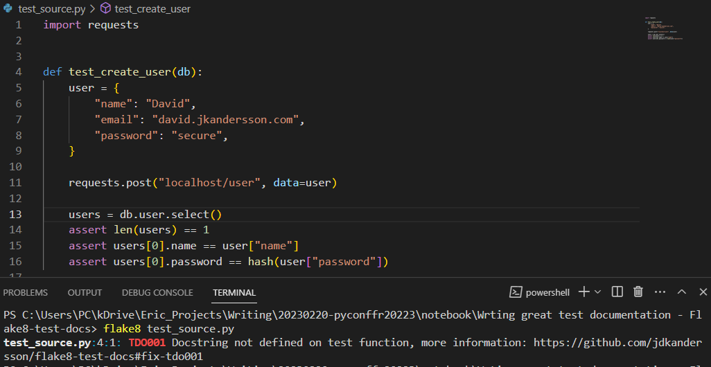
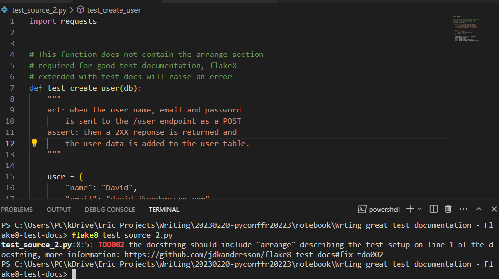
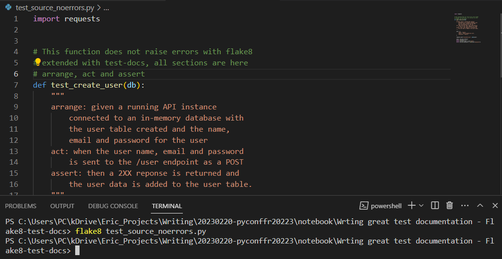

# Writing great test documentation 

This code is to illustrate the blog article I wrote after following the Pycon Fr 2023 convetion. The conference is "Writing great test documentation" by David Andersson.
This is a folder with 3 little examples of code. The code is meant to test [the linter that David Andersson wrote to be consistent with the documentation of the tests](https://github.com/jdkandersson/flake8-test-docs).
The code does not run, what matters here is how the functions are documented:

* test_source.py: Does not contain any documentation, raises a TDO001 error with the lintern
* test_source_2.py: Contains documentation but the "arrange" part is missing, raises a TDO002 error
* test_source_noerrors: Contains a properly documented test function, the lintern does not raise any errors.

## Installing and running the linter

To install the linter, you just need to:
```
pip install flake8 flake8-test-docs
```

Be aware that this will extend your flake8 configuration, you do not want this installed if you use flake8 to test anything else (or you are OK with having "TDO" errors raise every time you use flake8, but that is a terrible idea). Maybe you can install it in a special environment for testing, or something like that.

To launch it, you just have to launch flake8 once flake8-test-docs is installed, for example, from the folder where the python file is located:
```
flake8 test_source.py
```

## Example 1: test_source.py



As you can see, the message error redirects us to David's github where he tells us how to fix the TDO001 error: https://github.com/jdkandersson/flake8-test-docs#fix-tdo001

## Example 2: test_source_2.py



As you can see, the message error redirects us to David's github where he tells us how to fix the TDO001 error: https://github.com/jdkandersson/flake8-test-docs#fix-tdo002

## Example 3: test_source_noerror.py



As you can see, this function does not raise any error message.